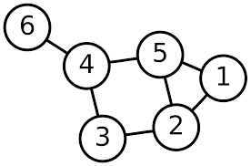

Definition
===

A *forest* is a graph with no cycles; a *tree* is a connected graph with no nontrivial closed trails.

Thus, a forest is a disjoint union of trees.

Example
====

The following graph is a forest consisting of three trees:

The following graph is a *not* a tree:

Consider the two conditions of being tree: being connected, and not having any cycles.  

The first condition is somehow saying that $$\Gamma$$ has *enough* edges: to be connected, we need a path between any two vertices, and the more edges we have, the more likely this is to happen.

The second condition is somehow saying that $$\Gamma$$ doesn't have *too many* edges: we *don't* want cycles, and having more edges makes that more likely.

Thus, being a tree a bit of a goldilocks condition -- it has *just the right* amount of edges.  It's not *just* how many edges the graph has, though -- the path graph $$P_4$$ has 4 vertices and 3 edges, and is a tree, but the disjoint union of a triangle and a single vertex also has 4 vertices and 3 edges but is not a tree.  

The following proposition summarises this discussion and makes it more precise:

Proposition
===

Let $$\Gamma$$ be a graph with $$n$$ vertices.  The following are equivalent:

1. $$\Gamma$$ is a tree.
2. Between any two vertices $$a,b\in V(\Gamma)$$, there is a unique path.
3. $$\Gamma$$ is connected, but removing any edge makes $$\Gamma$$ disconnected.
4. $$\Gamma$$ has no cycles, but adding any edges to $$\Gamma$$ creates a cycle.
5. $$\Gamma$$ is connected and has $$n-1$$ edges
6. $$\Gamma$$ has no cycles and has $$n-1$$ edges

Proof:
---

We will not show all of the equivalences.  Some are tricky to do directly; a few we will put on the practice sheet.

1 implies 3
===

Trees are by definition connected, so we must show that removing any edge of $$\Gamma$$ disconnects $$\Gamma$$.  Let $$a$$ and $$b$$ be two adjacent vertices, and suppose removing the edge between them did not disconnect $$\Gamma$$.  Then there is a path from $$a$$ to $$b$$ in $$\Gamma$$ not using the edge connecting them; adding the last edge back in makes a cycle, a condtradiction.  

3 implies 2
====

 Since $$\Gamma$$ is connected, there is at least one path between two vertices.   If there were two paths between $$a$$ and $$b$$, then deleting any edge $$e$$ that was only in one of the paths wouldn't disconnected $$\Gamma$$.

2 implies 1
=====

Suppose that $$\Gamma$$ is a graph with a unique path between any two vertices.  Then, in particular $$\Gamma$$ is connected, and so to show $$\Gamma$$ is a tree we must show it has no cycles.  

Suppose $$v_0, e_1, v_1,\dots, e_n, v_n=v_0$$ was a cycle in $$\Gamma$$.  Then there are two paths between $$v_0$$ and $$v_1$$ -- the edge $$e_1$$, or the path $$v_1, e_2, v_2,\dots, v_n=v_0$$.  This is a contradiction, and hence $$\Gamma$$ has no cycles.
