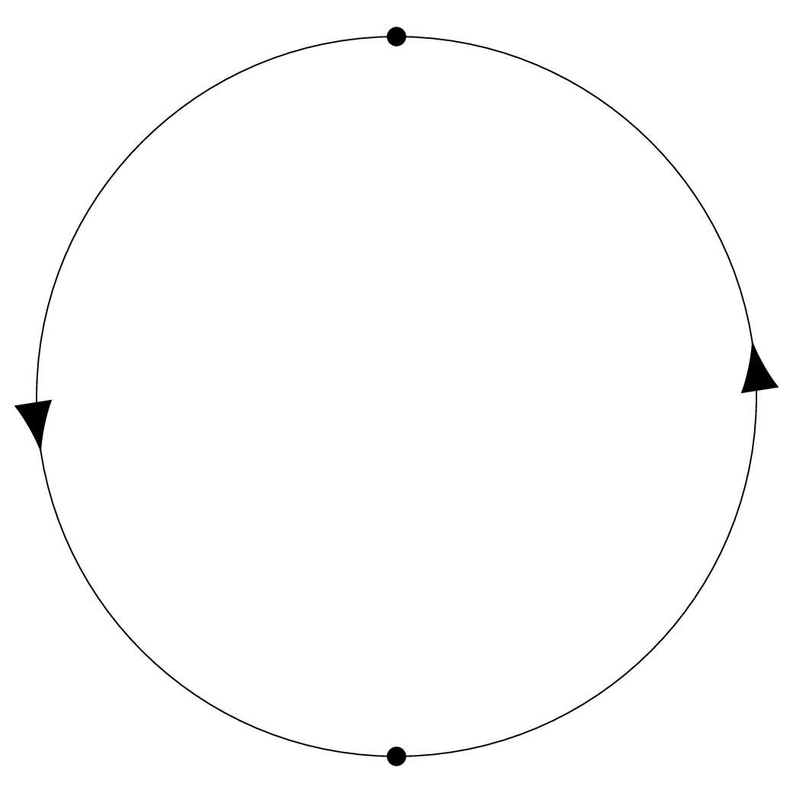
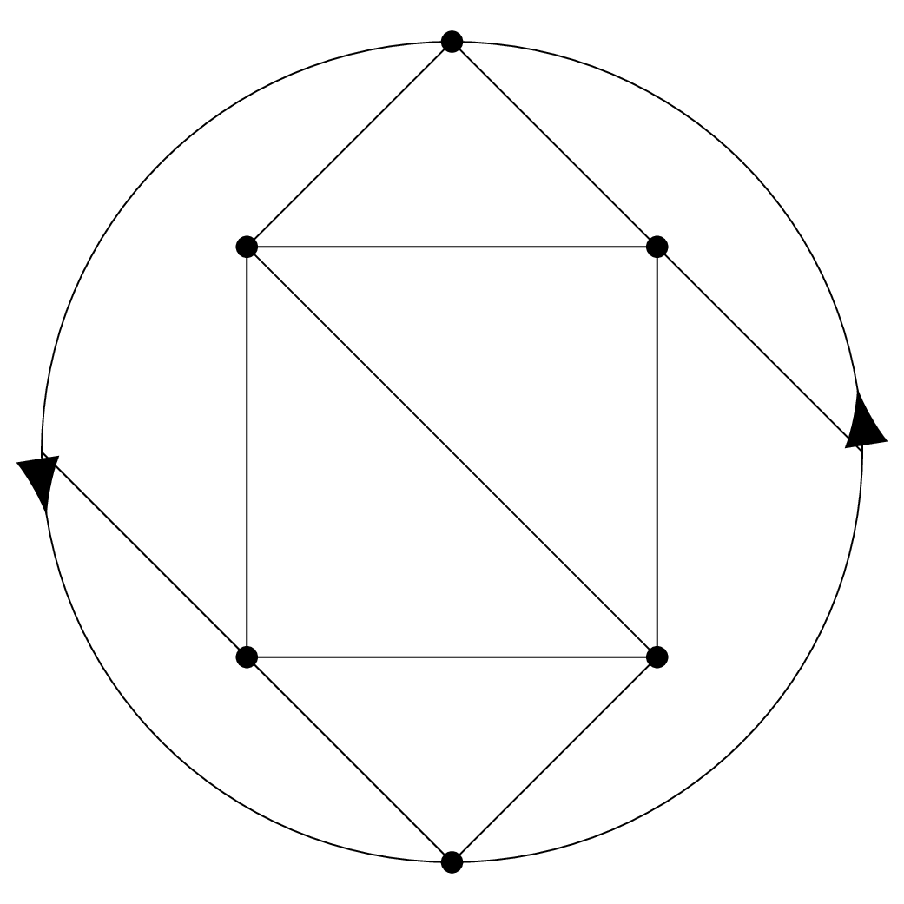

Plane models for higher genus curves
-------

Last session, we talked about the torus being the square with its opposite sides identified, and that this gave a convenient way to draw graphs on a torus.

We would like a similar way to draw graphs on higher genus surfaces.

If we trace the edges of the square clockwise, beginning at the bottom left corner, we get $$bab^{-1}a^{-1}$$, where $$a$$ means we travel in the same direction as the edge is oriented, while an $$a^{-1}$$ means we travel the edge in the opposite direction.

In general, we can make a surface of genus $$g$$ by taking a $$4g$$-gon, and identifying pairs of sides.  There is not a unique way of pairing the sides to get a genus $$g$$ surface.  One way is to identify opposite pairs of edges, another way is to label the edges so that if we go around the boundary clockwise the labels read $$\prod_{i=1}^g a_ib_ia_i^{-1}b_i^{-1}$$ -- that is, we just repeat the pattern we had on the square 4 times.  This is illustrated in the following picture:

It can be hard to visualize how folding the $$4g$$-gon up produces a genus $$g$$ surface; <a href="https://www.youtube.com/watch?v=G1yyfPShgqw"> This video shows this in the case of a two-holed surface </a> that should make it clear.

This construction will allow us to draw graphs on a surface of any genus without actually needing to have a 3-dimensional model.

Classification of Surfaces
---------

Recall that a surface is a space that locally looks like $$\mathbb{R}^2$$.  Examples that we have include $$\R^2$$ itself, the sphere $$S^2$$, and the donut with $$k$$ holes, or the unit disk.

We would like to have a list of all surfaces, and a way to tell which surface we have; to make this precise we're going to need a few definitions that we try to help motivate now.

Given a surface, we could just remove a point to get a new surface.  We saw that the sphere minus one point was isomorphic to $$\mathbb{R}^2$$; similarly, if you remove a point from $$\mathbb{R}^2$$ we get something that is the same as the cylinder $$\mathbb{R}\times S^1$$ (to see this, think polar coordinates!).

In topology we don't have distances, but these "missing" points give us ways to head off infinity -- we have a bit of a line that is all in our space, but the line never cross itself and doesn't have an endpoint.  We want to rule this out, and only consider spaces that are "finite" somehow -- these surfaces are called *compact*.  This is a handwavy discussion -- there is a technical definition you may have seen in topology or metric spaces, but we will not need this.

Furthermore, you could consider "surfaces with boundary" -- this is like thinking the earth had an edge that we could go off.  More mathematically, consder the closed disk $$x^2+y^2\leq 1$$.  At points where $$x^2+y^2<1$$, this space looks like just $$\mathbb{R}^2$$.  But at points where $$x^2+y^2=1$$ lie on the boundary, and it only looks like half of $$\mathbb{R}^2$$.  

When we say "surface", we will almost always mean surfaces without boundary, but to highlight this, we will sometimes use the following definition

Definition: A closed surface
====

A surface $$S$$ is *closed* if it does not have a boundary.

Our goal over the next few lectures will be to understand the classification of closed, compact surfaces -- that is, finite two dimensional worlds without boundary.  Right now, the only examples of these we know are the surface of genus $$g$$, for $$g\geq 0$$ -- that is, the donut with $$k$$ holes.  It turns out these only make up "half" of the surfaces -- the other half are the unorientable surfaces.

Unorientable surfaces
-----

In this half of the lecture, we introduce the real projective plane, the simplest closed compact unorientable surface.  

Before we do that, it is easiest to review an unorientable surface with boundary that may be more familiar: the Mobius band.

The Mobius band
===

Suppose one has a strip of paper and glues the opposite edges together in the natural way -- this makes a cylinder.

If instead, one glued the ends together with half a twist, one would get the Mobius band:

The mobius band is not the same topological space as the cylinder.  One way to see this is that it is *unorientable* -- there is not a consistent notion of left and right on the Mobius band.  If you start at one point on the Mobius band, and travel along it until you jump across the other side of the identification, you will eventually return to where you started.  However, your left and right will have been interchanged!  This is seen in the following pictures, [stolen from this blog post](https://haggisthesheep.wordpress.com/2009/06/15/mobius-strips/):

The creature started out, his right hand was blue, but when he returns from his trip around the mobius band it is now his left hand that is blue!

The Mobius band only has one edge -- if you start on the top edge and go around to the end, you will jump to the other side of the bottom edge.  Furthermore, if you cut the Mobius band in half down the line in the middle (the long way), then it won't be cut into two pieces!  (Try it yourself at home).

The issue with the Mobius band in terms of classification is that it has a boundary component, and hence isn't closed.  We now correct that now.

Real Projective Plane
====

The (real) projective plane $$\mathbb{RP}^2$$ is what you get when you take the mobius band and glue it two a disk along their one common circle.  It is a closed, compact surface, but you can't draw it in $$\mathbb{R}^3$$ without it passing through itself.  

We need a planar representation of the projective plane, along the same lines as our planar representations of the surface of genus $$g$$ we gave in the first half of this lecture.  To do this, we claim that the real projective plane is the same as the disk with opposite sides of the boundary identified, as in the following picture:

 

We now have two descriptions of $$\mathbb{RP}^2$$ -- as a mobius band glued to a disk, and as a disk with opposite points on the boundary identified.  We should check that they are the same, which can be done by cutting and pasting, as illustrated in the following picture:

The part labeled [1] begins with a disk with opposite parts of the boundary identified.  We cut a strip $$J$$ out of the middle of the disk -- this is the Mobius band.

The remaining pieces $$F$$ and $$R$$, when we glue them together as the boundary of the disk was, becomes just a disk.

The part labelled [2] is another way to see it that is the inverse of what I drew on the board.  

Graphs on $$\mathbb{RP}^2$$
====

Since we have a planar representation of $$\mathbb{RP}^2$$ we have a handy way to draw graphs on it.  We draw a graph inside a circle, and if we can draw edges that hit the boundary of the circle, and they will continue on the other side.  

As an example, we show how $$K_5$$ can be drawn on $$\mathbb{RP^2}$$ below:

Four of the vertices are in the interior of the circle, the fifth vertex is on the boundary and hence appears twice, at the very top and very bottom.  The edge from the uppr right vertex going diagonal down hits the boundary at the very right, and then continues on its way starting again from the very left.

