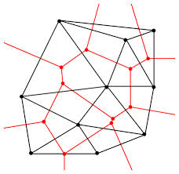

Theorem
====

The Euler characteristic is well defined

Proof
====

The point is that given two different graphs $$\Gamma_1$$ and $$\Gamma_2$$ on $$S$$, it is not clear that $$\chi(\Gamma_1)=\chi(\Gamma_2)$$.

The basic idea of the proof is that are there are two basic modifications that we can do to graphs on surfaces; that these moves obvious do not change the euler characteristic, and that we can move between any two different graphs $$\Gamma_1$$ and $$\Gamma_2$$ on $$S$$ by a sequence of these moves.

The two basic moves are:

1. Splitting an edge into two by adding a vertex of degree 2 in the middle.
2. Adding a vertex $$v$$ of degree 1, and an edge $$e$$ connecting $$v$$ to an existing vertex.
3. Splitting a face into two by adding an extra edge between two existing vertices.

In the two cases, we have increased both $$v$$ and $$e$$ by one, and so when we compute $$\chi(S)=v-e+f$$ these two changes cancel.

In the third case, both $$e$$ and $$f$$ increase by one, and again these changes cancel.  

To see that these moves suffice, we sweep a few topological technicalities under the rug.  We first argue that we can assume that $$\Gamma_1$$ and $$\Gamma_2$$ intersect nicely -- that they only intersect in the middle of edges, and they always locally intersect "transversely", which is a technical topological term we will not define, but just means that they cross each, and directly, and then.

Then there is a natural way to turn $$\Gamma_1\cup\Gamma_2$$ into a graph -- turn each intersection point into a new vertex, and divide the corresponding edges into more edges.

Then we can go from $$\Gamma_1$$ to $$\Gamma_1\cup\Gamma_2$$ by adding the three moves.   

We can also do any of the three moves in reverse (as long as we don't reach a few degenerate situations) and not change the Euler characteristic.  We can go from $$\Gamma_1\cup\Gamma_2$$ by doing these moves in reverse, and hence

$$\chi(\Gamma_1)=\chi(\Gamma_1\cup\Gamma_2)=\chi(\Gamma_2)$$

as desired.

Lemma
====

Let $$S_g$$ be a surface of genus $$g$$; then $$\chi(S_g)=2-2g$$.

Let $$U_k$$ be a sphere with $$k$$ moebius bands sewn in.  Then $$\chi(U_k)=2-k$$.

Proof

Applications of Euler characteristic
------

We briefly survey applications of Euler characteristic

Proving graphs can't be embedded on certain surfaces
========

The euler characteristic of surfaces can be used to show some graphs can't be embedded on some surfaces. 

If we are given a graph $$\Gamma$$, we know its number of edges and number of vertices.  $$\Gamma$$ may be embeddable on different surfaces, with the number of faces changing (and maybe not being just disks).

If $$\Gamma$$ is simple, then every face must have at least 3 edges, perhaps more.  But each edge is incident to two faces.  If $$\Gamma$$ were drawn on a surface so that every face was a triangle, we would have $$2e=3f$$ by essentially the handshaking argument, in if every face has at least three sides we have $$2e\geq 3f$$.

Lemma
====

The complete graph $$K_8$$ cannot be embedded on the torus.

Proof
===

Since $$K_8$$ has 8 vertices and $$\binom{8}{2}=28$$ edges; suppose it was embedded on the torus with $$f$$ faces.  We'd have $$8-28+f=0$$, and hence $$f$$ would be 20.  But since $$K_8$$ is simple each face would have to have at least three sides, and so $$K_8$$ would need at least $$3/2*20=30$$ edges to account for this.  

Dual graphs
====
Before giving another application, we briefly expand on our statement that the inequality $$2e\geq 3f$$ is *essentially* the handshaking argument, by showing how it *is* the handshaking argument.

Definition
====
Given a graph $$\Gamma$$ embedded on a surface $$S$$, the dual graph $$\Gamma^\prime$$ is another graph embedded on $$S$$, obtained as follows:

1. For every face of $$\Gamma$$, place a vertex $$v$$ in the middle of $$f$$
2. Every edge $$e$$ of $$\Gamma$$ is the boundary between two faces of $$\Gamma$$.  In $$\Gamma^\prime$$, we add an edge connected the corresponding vertices.
3. As a result, every face of $$\Gamma^\prime$$ will contain exactly one vertex of $$\Gamma$$

Thus, we see that taking the dual graph interchanges the roles of vertices and faces.

Here's an example stolen from the internet -- the red graph is dual to the black graph:

For more examples, the [wikipedia page](https://en.wikipedia.org/wiki/Dual_graph) is quite useful.

We will not make any essential use of the dual graph but it can be conceptually enlightening in two ways -- as already mentioned, it explains the handshaking type argument we use with faces and edges. It also sheds light on colouring faces of a graph $$\Gamma$$ on a surface: this is just the same as colouring vertices of the dual graph $$\Gamma^\prime$$

Lemma
====

A videogame graph will always be a torus.

Proof
====

In the video game graph, each vertex had degree $$4$$, and each face was a square.  The handshaking lemma then gives $$4v=2e$$, and so $$e=2v$$.  Similarly, counting handshakes between faces and edges gives $$4f=2e$$, and so $$e=2f$$, and hence $$f=v$$.  Thus, for any embedding that locally gives the videogame graph we have

$$\chi(v-e+f)=v-2v+v=0$$, and hence we must 

