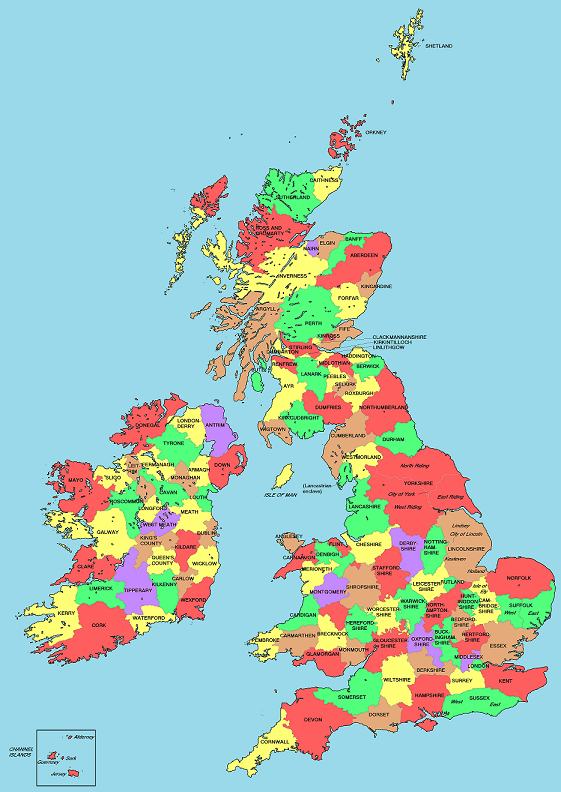
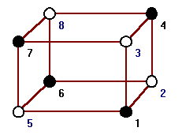

The last topic we will cover is coulouring graphs.  There will be three elements to this -- chromatic number, chromatic index, and chromatic polynomials.

Chromatic number
-----

When colouring maps, often the different regions (countries, counties, states) are given different colours, with the idea that adjance regions should have different colours so the boundaries can be easily seen.  For instance, in this map of Britain and Ireland each county is coloured one five colours (red, yellow, green, brown and purple), with counties that border on each other having different colours.

Definition: Chromatic number
====

The *chromatic number*, denoted $$\chi(\Gamma)$$, of a graph $$\Gamma$$ is the least number of colours needed to colour the vertices of $$\Gamma$$ so that adjacent vertices are given different colours.

The study of chromatic numbers began with trying to colour maps as described above: it was conjectured in the 1800's that any map drawn on the sphere could be coloured with only four colours.  This does not have much practical application: note, for instance, that the map of Britain above uses five colours.   This conjecture was not proven for more than a hundred years, and is now known as the [four colour theorem](https://en.wikipedia.org/wiki/Four_color_theorem).

Theorem (Appel and Haken, 1976)
===
Any planar graph $$G$$ can be coloured with four colours; i.e., $$\chi(G)\leq 4$$.

The proof of the four colours theorem is enormous, taking hundreds of pages as well as computer calculations.  It was the first major theorem to rely heavily on computer calculations, and was very controversial at the time because it raised philosophical questions about what mathematics is for.  We often say we just want to prove things, but if proof involves checking thousands of cases using a computer than what use is it, really?  What we really want is *human understanding*, and a proof is one way of doing that.

The original proof of the four colour theorem has been simplified some, but it still huge.  It has also been *formalized*, i.e., written in a special computer language that checks that each step follows logical from the previous one and no steps are skipped.  

Example: Complete graph
====

The complete graph $$K_n$$ has chromatic number $$\chi(K_n)=n$$.  Since evevery vertex is adjacent to every other vertex, no two vertices can have the same colour. $$\square$$

Notation warning
====
Not that we used $$\chi$$ earlier to denote the Euler characteristic, but there we talked about the Euler characteristic of a surface, $$\chi(S)$$, where we talk about chromatic number of a graph, and so it should be clear what $$\chi$$ means from whether its input is a surface or a graph, but this should be unnecessary as words and context in the problem should make which meaning of $$\chi$$ is being used.

Example: Cube and octahedron
====

Another potential source of confusion is when graphs are drawn on surfaces.  In the map discussion above, we were trying to colour the faces of the graph, where in the definition of chromatic number we are colouring the vertices of the graph.  If there is a graph on a surface, the colouring we are trying to do should be made clear from context, but we'd like to highlight that these two viewpoints are related by the notion of the dual graph of a graph on a surface -- colouring the faces of a graph $$\Gamma$$ on a surface $$S$$ is equivalent to colouring the vertices of its dual graph.

For example, let $$C$$ denote the cube graph.  What's $$\chi(C)$$?  The cube has an edge, and so it takes at least two colours to colour.  On the other hand, it is easy to see that two colours suffice, as in the following drawing:

If we want to colour the *faces* of the cube, however, we quickly see that we are going to need at least three colours: pick any vertex, and look at the three faces that touch that vertex; they will all be touching each other, and thus will need to be different colours.  

On the other hand, we can describe a colouring of the faces of the cube that takes only three colours -- colour each face and the face directly opposite it the same colour.

Example: Bipartite graphs
====
We have already discussed one example of chromatic number, in bipartite graphs.  A graph has chromatic number 1 if and only if it has no edges.  A graph with at least one edge that has chromatic number two is bipartite; in particular, we see that the cube had chromatic number 2 because it is bipartite, whereas the octahedron has triangles and hence had higher chromatic number.

Example: the cycle $$C_n$$
====
When $$n$$ is even, $$C_n$$ is bipartite, and so can be coloured with two colours, just alternating colours as we pass through the cycle.  

if $$n$$ is odd, $$C_n$$ is not bipartite, and so we will need at least three colours to colour the vertices.  It is easy to see that three is enough -- just alternate with two colours until we get to the very last vertex of the cycle, which we can make the third colour.

Upper bounds on $$\chi(G)$$
------

Definition
====
We use $$\Delta(G)$$ to denote the maximum degree of $$G$$, i.e., the highest degree of any vertex.

Theorem
====
$$\chi(G)\leq \Delta(G)+1$$

Proof
====

The basic idea is to just colour the vertices one by one -- when we go to colour a vertex, it touches at most $$\Delta(G)$$ vertices that are already coloured, and we just give it a colour that isn't one of those.  If we have $$\Delta(G)+1$$ colours available this is always possible.

To prove this more formally, we use induction on the number of vertices.  It is clear that any graph with 0 or 1 vertex can be coloured with 1 colour.  

Suppose now that we have fixed an interger $$m$$, and we know that every graph with $$\Delta(G)\leq m$$ and with less than $$k$$ vertices can be coloured with at most $$m+1$$ colours.  We want to show that any graph $$\Gamma$$ with $$k$$ vertices can be coloured with at most $$m+1$$ vertices.  

Pick any vertex $$v$$ of $$\Gamma$$ and remove it.  The resulting graph $$\Gamma\setminus $$ has $$k-1$$ vertices and so by the inductive hypothesis can be coloured with at most $$m+1$$ colours.  Now, we need to colour $$v$$.  But $$v$$ is adjacent to at most $$m$$ vertices of $$\Gamma$$, so at least one of $$m+1$$ colours does not appear at a vertex adjacent to $$v$$ -- colouring $$v$$ this colour does what we need.

The 6 Colour Theorem
----

Although the 4 colour theorem is extremely difficult to prove, weaker bounds are easy.  We will prove that 6 colours suffices for any planar map now; with a little more work the argument can be adjusted to prove that actually 5 colours is enough, but getting to 4 is very hard.

Theorem
====
Any planar graph has $$\chi(G)\leq 6$$.

Proof
===

The proof of this theorem is in some ways very similar to the previous proof.  We will induction, deleting vertices one by one.  

We need to use that $$G$$ is planar somehow.  And from the previous theorem, we see that we want $$G$$ to have vertices with low degree, because deleting them leads to efficient colourings.  The following lemma connects these ideas

Lemma
====

Any planar graph $$G$$ has a vertex $$v$$ of degree at most $$5$$.  

Before proving this lemma, we will see how the lemma leads to a proof of the 6 colour theorem.

We again use induction.  As a base case, it is clear than any planar graph with at most 6 vertices can be coloured with 6 colours.  Now, suppose that all planar graphs with less than $$k$$ vertices can be coloured with 6 colours, and suppose $$\Gamma$$ is a planar graph with $$k$$ vertices.  We must show that $$\chi(\Gamma)\leq 6$$.

By the Lemma, since $$\Gamma$$ is planar it has a vertex $$v$$ with $$d(v)\leq 5$$.  Deleting $$v$$, the graph $$\Gamma\setminus v$$ has strictly less than $$k$$ vertices, and hence can be coloured with 6 colours.  Now, taking this colouring and trying to extend it to a colouring of $$\Gamma$$ we just have to colour $$v$$.  But $$v$$ is only adjacent to 5 vertices, and so at least one of our six colours is not used in these vertices.  If we colour $$v$$ one of these unused colours, then we have the colouring we want.  

We will prove the lemma needed at the beginning of the next session.

